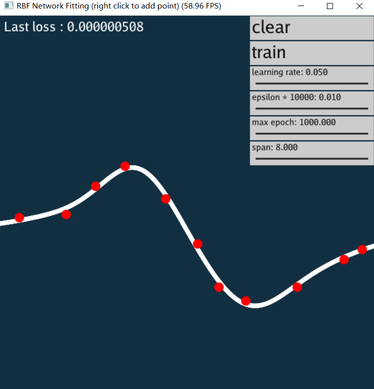
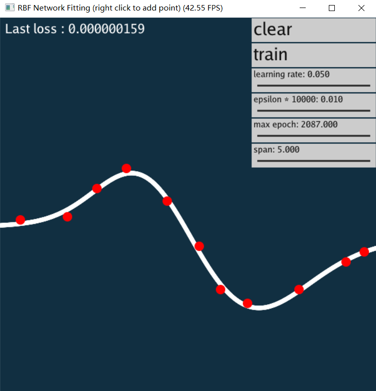
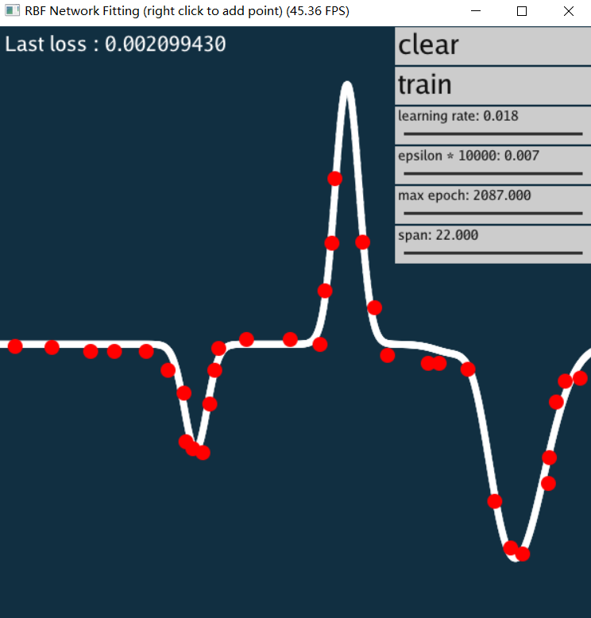
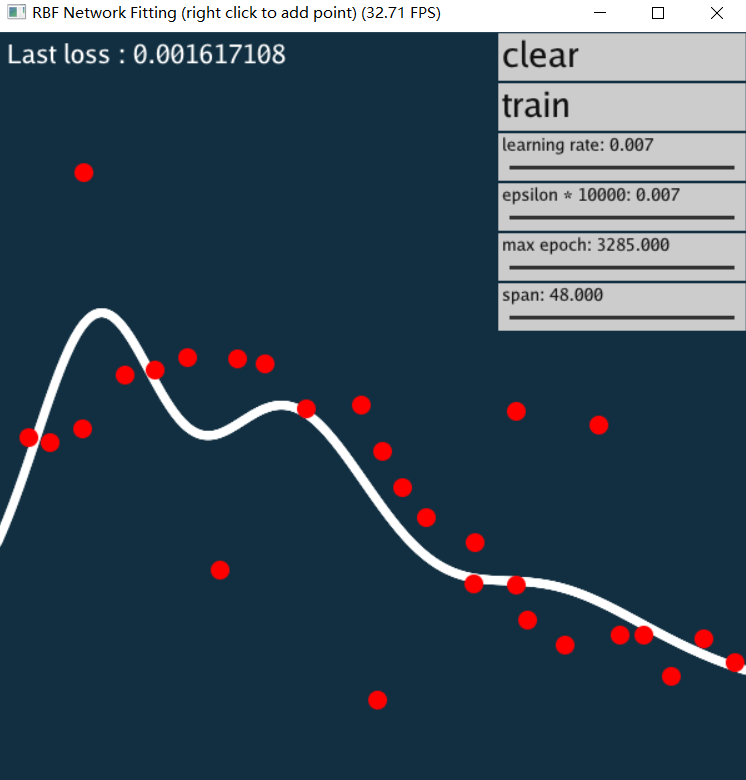

# GAMES102 HW2

## 任务

- 使用 RBF 神经网络函数来拟合数据

  > 仍限制在函数情形

- 与作业 1 的方法比较

## 实验方法

- 拟合函数为 $f(x)=w_0+\sum_{i=1}^{n}w_i*g_{0,1}(a_ix+b_i)$,
  其中权重 $a\in R^n$, $b\in R^n$, $w\in R^{n+1}$, 径向基函数 $g_{0,1}(x)=\frac{1}{\sqrt{2\pi}}e^{-\frac{x^2}{2}}$.

  使用MSE损失函数对输出结果进进行损失计算，用Adam优化方法优化权重。
  
## 代码实现

- 代码用Python3.7和PyTorch1.5框架实现，GUI使用Taichi0.7.1封装的EasyGUI实现。
  函数拟合的主要代码在rbf.py中。

- 在拟合值域较大的样本集时效果不佳，可能是径向基函数本身值域的限制，以及梯度下降时步长难以控制的原因。
  所以本次实验把定义域、值域均限制在[-1, 1].

## 运行结果

- 设置合理的学习率、损失阈值、最大训练迭代次数，可以使网络拟合出高精度的函数。
  与作业 1 的径向基函数比较，省去了自行调整均值、标准差的步骤。

- 即使是在有少许噪声的情况下，也不像作业 1 的径向基函数那样无法去噪。
  

- 不过，因为目前的学习率、损失函数、最大训练迭代次数，以及隐藏层节点数量都是自定义的，所以结果的质量受到经验的影响依然很大。
  期待未来在元学习上的研究进展。

- 详细操作方式与结果显示见视频。
