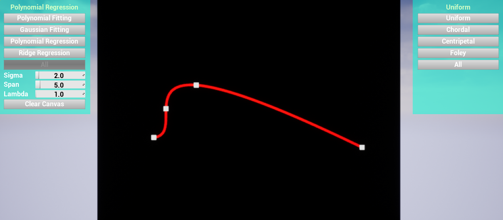
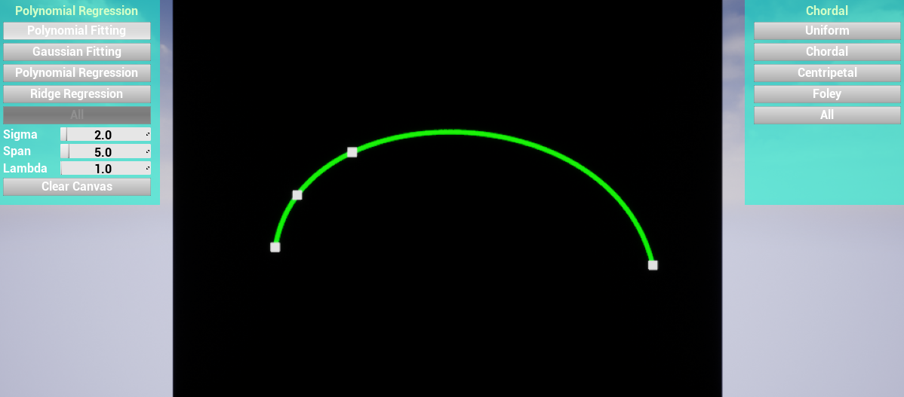
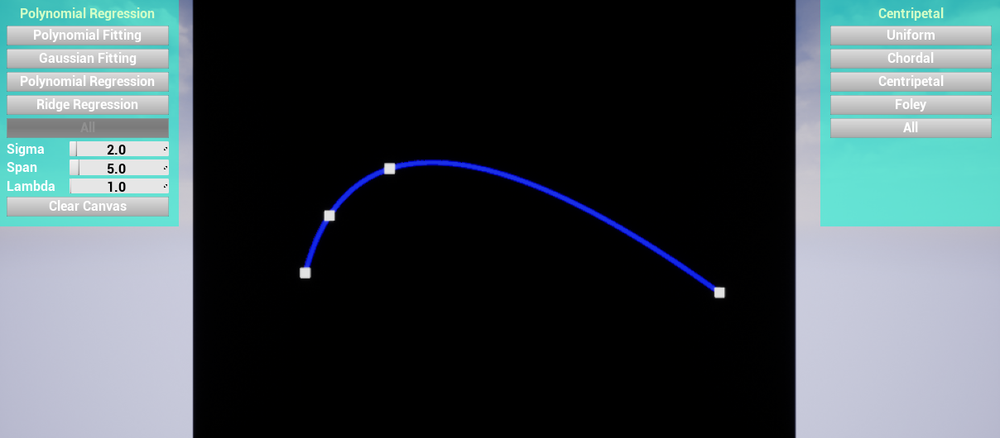
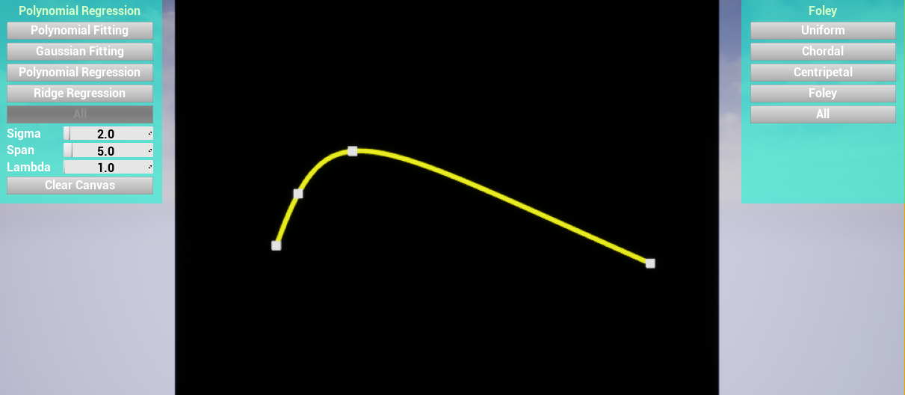
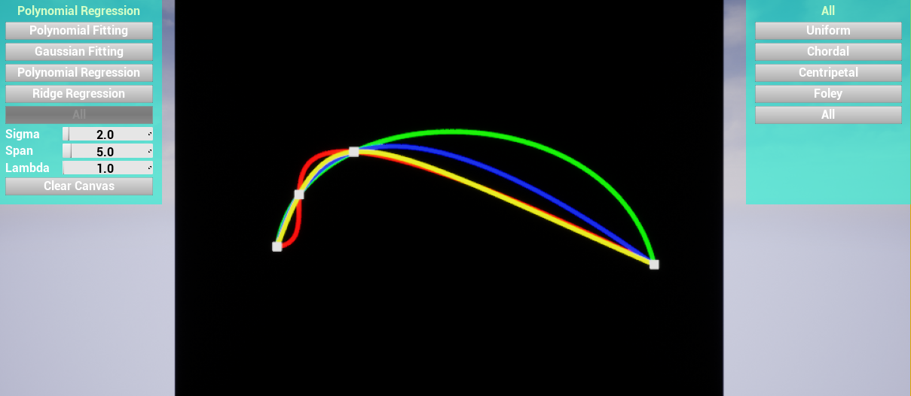
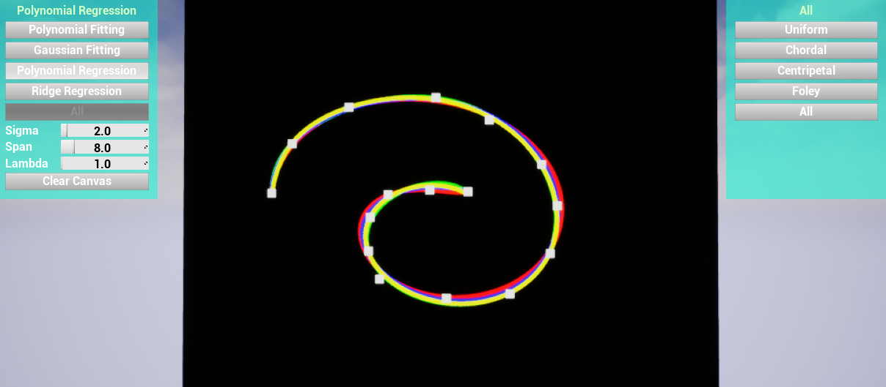

# GAMES102 HW3

## 任务

使用单参数曲线来拟合平面上任意有序点列

## 目的

- 学习参数曲线拟合
- 使用各种参数化方法，并进行比较

## 实验方法

- 拟合与插值方法使用作业1中的方法。先用参数化的方式求出每个点对应的参数值，然后对点的每个维度均做一次拟合得到单个维度的参数方程。
  其中多项式线性回归的方法效果较好，所以后面的对比都使用多项式线性回归的拟合方法。
  
- 参数化方法使用Uniform, Chordal, Centripetal, Foley四种。

### Uniform Parametrization

- $t_{i+1}-t_{i}=C$

### Chordal Parametrization

- $t_{i+1}-t_{i}=\lVert \bold{P}_{i+1}-\bold{P}_{i} \rVert$

### Centripetal Parametrization

- $t_{i+1}-t_{i}=\sqrt{\lVert \bold{P}_{i+1}-\bold{P}_{i} \rVert}$

### Foley Parametrization

- $$
t_{i+1}-t_{i}=\left\{
             \begin{array}{lr}
             d_{i}*(1 + \frac{3}{2}\frac{\hat{\alpha}_{i+1}d_{i}}{d_{i}+d_{i+1}}), & i=0 \\
             d_{i}*(1 + \frac{3}{2}\frac{\hat{\alpha}_{i}d_{i-1}}{d_{i-1}+d_{i}}), & i+1=n-1.\\
             d_{i}*(1 + \frac{3}{2}\frac{\hat{\alpha}_{i}d_{i-1}}{d_{i-1}+d_{i}} + \frac{3}{2}\frac{\hat{\alpha}_{i+1}d_{i}}{d_{i}+d_{i+1}}), & else
             \end{array}
\right.
$$
  $\hat{\alpha}_i=\min{(\frac{\pi}{2},\pi-\alpha_i)}$,
  $\alpha_i=angle(\bold{P}_{i-1},\bold{P}_{i},\bold{P}_{i+1})$.
  
  
## 代码实现

- 程序用Unreal Engine 4.24引擎实现，除UI布局使用蓝图实现之外，其他功能均用C++实现。
  函数拟合的代码在FunctionFitting文件夹中，参数化的代码在Parametrization/Parametrization.h中。

- 曲线参数值均限制在[0, 1].

## 运行结果

- 总体来看，多项式回归的效果都比较不错。

- 对于间隔变化较大的点集，使用Chordal和Centripetal方式会使曲线更平滑。Centripetal和Foley方式在保留平滑度的同时，重心也向密集处偏移更多。
  

- 由于这里是单独的一段曲线，点集增加时需要增加多项式的次数。

- 详细操作方式与结果显示见视频。
