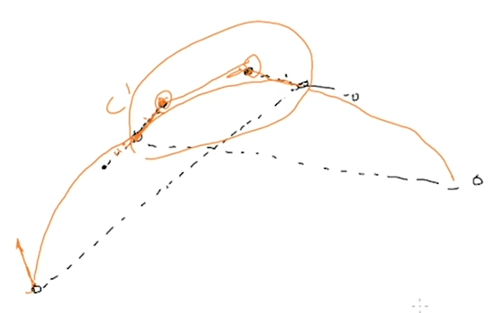

# GAMES102 HW4

## 任务

模仿 PowerPoint 写一个曲线设计与编辑工具

- 输入有序点列（型值点），实时生成分段的三次样条曲线
- 可修改拖动型值点的位置（保持整条曲线 $C^2$）
- 可编辑型值点处的切线信息，成为 $G^1$ 或 $G^0$ 

## 目的

- 学习三次样条函数的求解
- 了解曲线设计和编辑工具的原理

## 实验方法

- 保持$C^2$连续可以使用全局插值方法。这里使用三次Bezier曲线插值，即相邻两点之间新增两点形成Bezier曲线，且使相邻的曲线$P$与曲线$Q$满足（由端点求导的性质得到）：
  $P_{3}=Q_{0}, P_{2}-P_{3}=Q_{0}-Q_{1}, P_{1}-2P_{2}+P_{3}=Q_{0}-2Q_{1}+Q_{2}$.
  另外补充首尾曲线$A,B$的两个条件：$A_{0}-2A_{1}+A_{2}=0, B_{1}-2B_{2}+B_{3}=0$.
  通过这种方式可以构造出对角占优的线性方程组。
  
- 另外，连续性也可以通过递推的方式维护：新增或调整型值点时，先调整型值点相邻曲线的形状，然后再调整相邻点的相邻曲线的形状，以此类推直到调整至首尾点，或满足一些条件，如：
  1. 型值点为$C^0$连续，切线不需要满足任何条件；
  2. 型值点为$G^1$连续且切线共线（内积平方等于切线长度平方的乘积）；
  3. 型值点为$C^1$连续且切线长度相等；
  4. 型值点为$G^2$连续且端点$P,Q$满足$P'=kQ',P''=k^2Q''+jQ'$（即$P'$与$Q'$共线，且$P''-k^2Q''$与$Q'$共线）；
  5. 型值点为$C^2$连续且端点$P,Q$满足$P'=Q',P''=Q''$。
  新增点时先用Lecture5中如下图所示的调整方式调整至$C^1$连续，然后再用上述递推方式调整前面的点，比全局插值的优势在于可以兼容修改过其他点连续性的大部分情况。
  

  
## 代码实现

- 程序用Unreal Engine 4.24引擎实现，除UI布局使用蓝图实现之外，其他功能均用C++实现。
  曲线操作的实现在Plugins/CurveBuilder/Source/CurveBuilder/Splines文件夹中，
  全局插值的实现在Plugins/CurveBuilder/Source/CurveBuilder/CurveOperations文件夹中。

## 运行结果

- 由于使用的方法可能与Powerpoint等软件的方法不同，调整曲线时的行为会有所不同，如调整$C^1$和$G^1$连续性的点时，只有相邻曲线会改变形状。
  （如视频1所示）
  
- 另外，本次也尝试实现了调整$G^2$连续性或$C^2$连续性的点，但是使用递推的方式调整时，调整的幅度会随递推而增大，导致效果不好。
  可能先通过递推的方式，通过一系列待调整点的连续性得到一系列需要满足的方程组，然后做一次局部插值，效果会好一些，但是本次没有实现这种方法。
  （如视频2所示）
  
- 在实现高阶连续的调整时，分段的三次样条的实现确实比较繁琐，而如B-样条这种使用统一表达式的曲线进行调整时会表现得更简洁一些，尽管分段曲线对形状的控制更加直观。
  平面设计软件和建模软件的侧重点不同，可能也导致了它们把不同性质的曲线作为各自的常用曲线。

