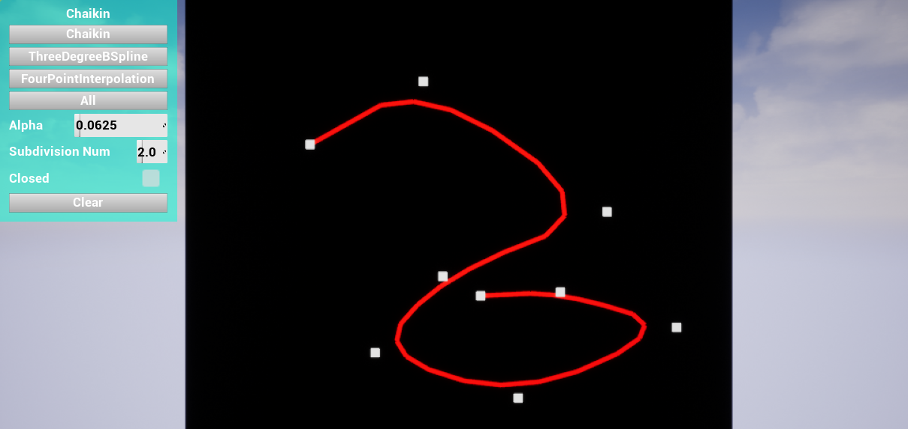
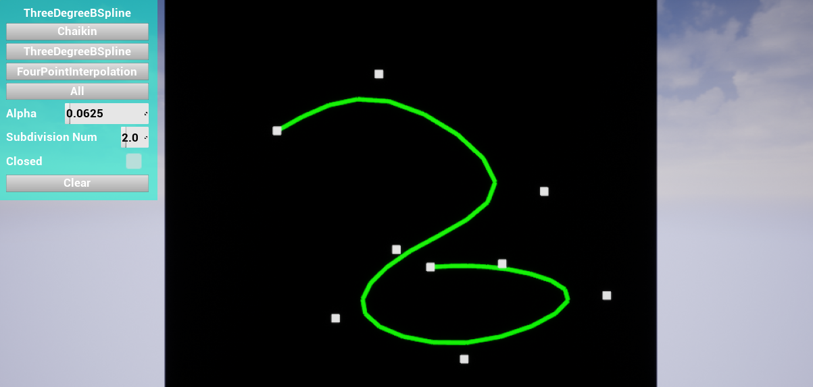
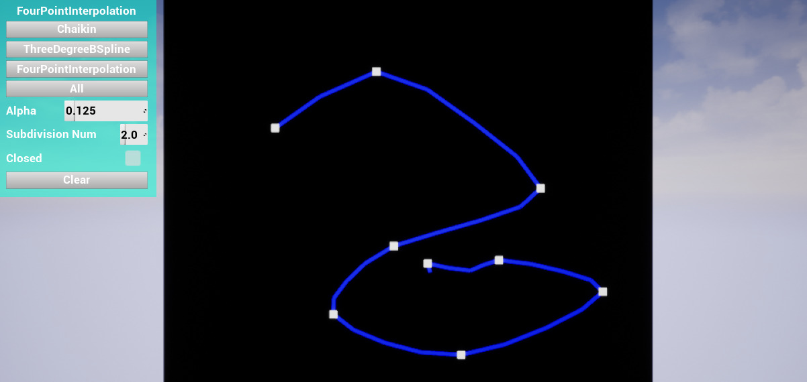
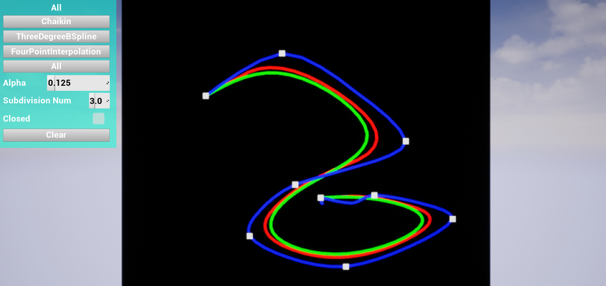
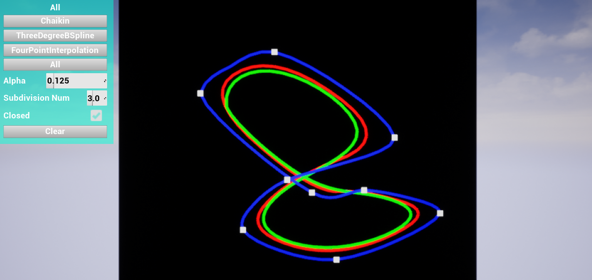
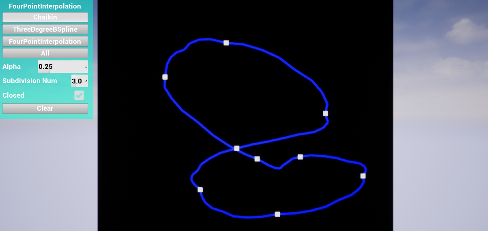
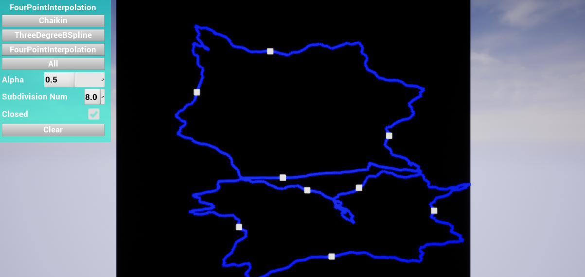

# GAMES102 HW5

## 任务

实现两种细分曲线的生成方法

- 逼近型细分：Chaikin 方法（二次 B 样条），三次 B 样条细分方法
- 插值型细分：4 点细分方法

## 目的

学习使用细分方法生成曲线的原理和方法

## 实验方法

- 细分方法使用Chaikin（二次B-样条逼近）, 三次B-样条逼近，四点插值。
  对于不闭合的曲线，超过范围的索引视为第一个顶点或最后一个顶点的索引。
  如：当$i=0$时，需要计算非闭合曲线的$v'_{2i}=\frac{1}{4}v_{i-1}+\frac{3}{4}v_{i}$，则视为
  $v'_{0}=\frac{1}{4}v_{0}+\frac{3}{4}v_{0}$

### 二次B-样条逼近细分

- $v'_{2i}=\frac{1}{4}v_{i-1}+\frac{3}{4}v_{i}$
  $v'_{2i+1}=\frac{3}{4}v_{i}+\frac{1}{4}v_{i+1}$

### 三次B-样条逼近细分

- $v'_{2i}=\frac{1}{8}v_{i-1}+\frac{3}{4}v_{i}+\frac{1}{8}v_{i+1}$
- $v'_{2i+1}=\frac{1}{2}v_{i}+\frac{1}{2}v_{i+1}$

### 四点插值细分

- $v'_{2i}=v_{i}$
- $v'_{2i+1}=\frac{v_{i}+v_{i+1}}{2}+\alpha(\frac{v_{i}+v_{i+1}}{2}-\frac{v_{i-1}+v_{i+2}}{2})$
  
## 代码实现

- 程序用Unreal Engine 4.24引擎实现，除UI布局使用蓝图实现之外，其他功能均用C++实现。
  曲线细分的代码在Source/GAMES102HW5/Subdivision文件夹中。

## 运行结果

- 二次B-样条逼近细分：

- 三次B-样条逼近细分：

- 四点插值细分：

- 三次细分之后就可以保证四点插值之后比较光滑：

- 闭合曲线：

- 出现分形现象

- 详细操作方式与结果显示见视频。
