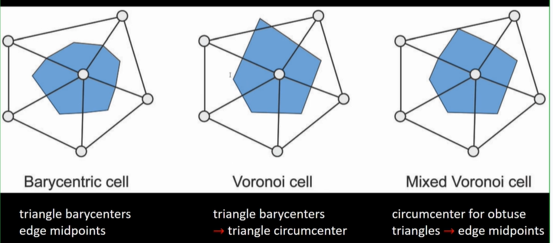
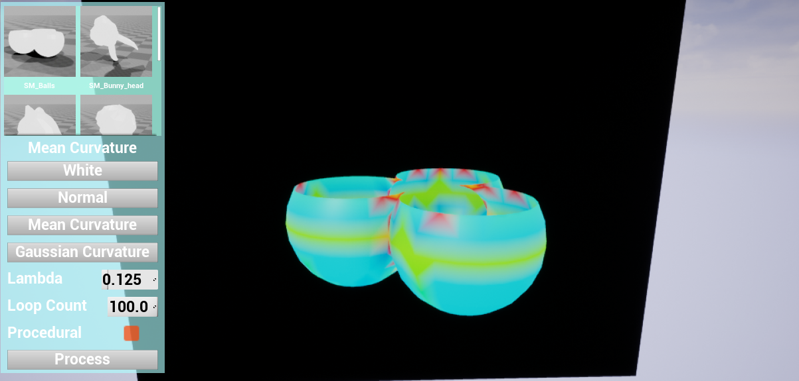
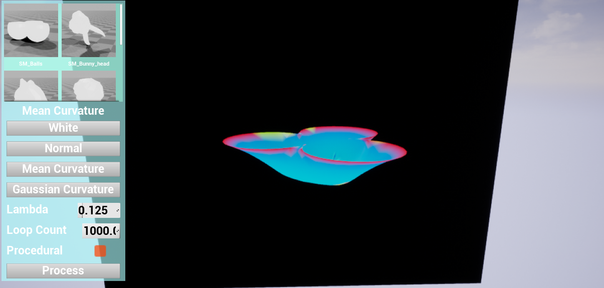
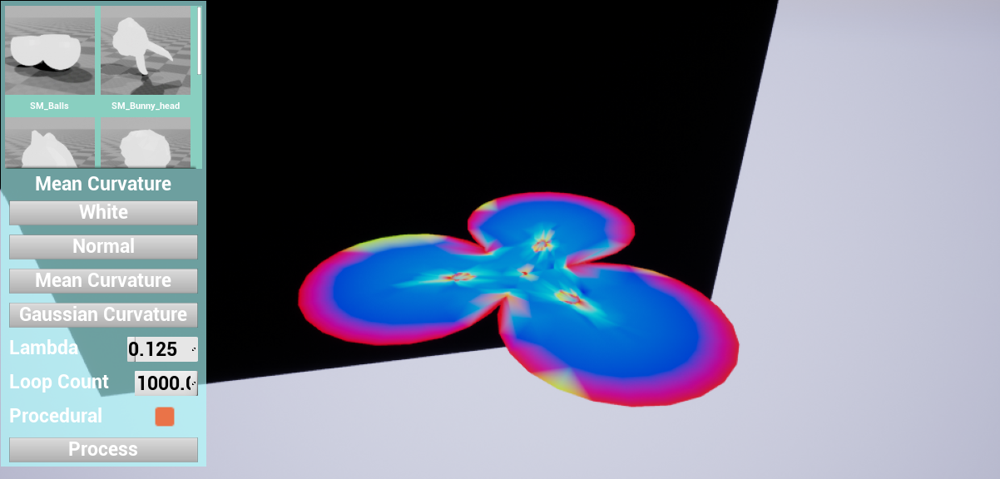
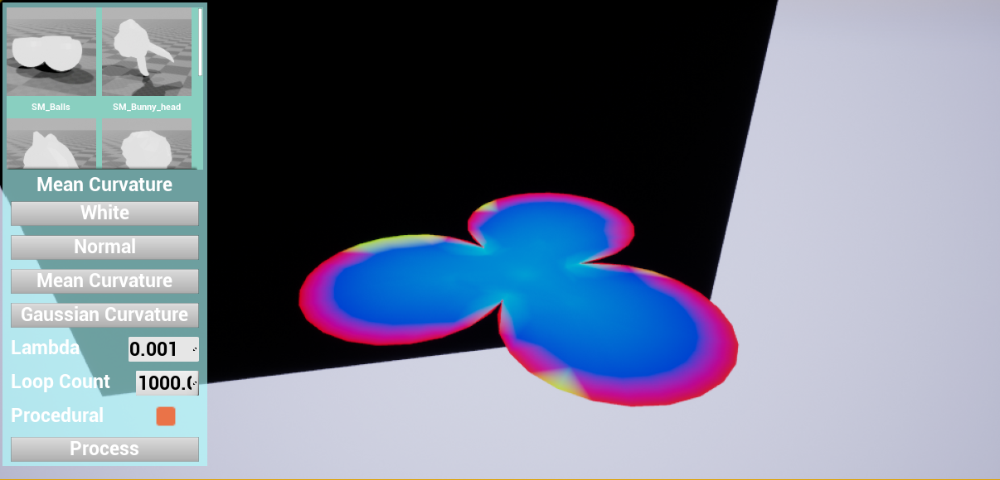
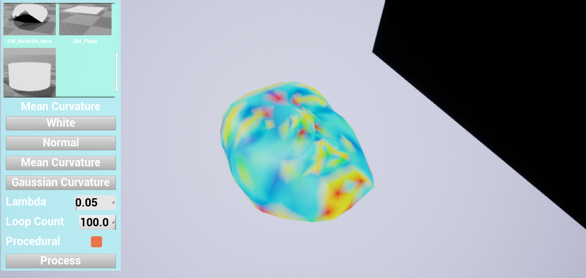
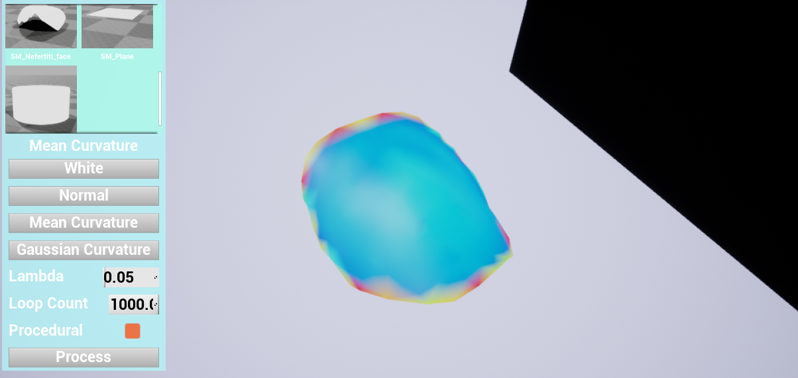
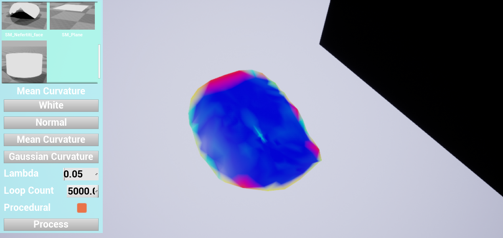
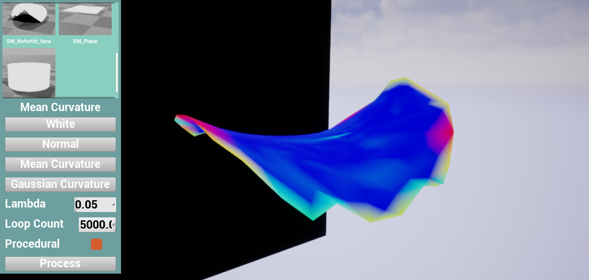

# GAMES102 HW6 
 
## 任务 
 
实现极小曲面的局部法 
 
- 寻找非封闭三角网格曲面的边界 
- 每个顶点更新坐标 
- 迭代给定次数或迭代至收敛 
 
【可选】计算三角网格顶点的离散高斯曲率和平均曲率，并用颜色进行可视化 
 
## 目的 
 
学习三角网格的半边数据结构及操作 
 
 
## 实验方法 
 
### 实现极小曲面的局部法 
 
- 利用最小化离散平均曲率的方法构造局部极小曲面，具体离散平均曲率的计算方式使用Lalpace-Beltrami算子。 
  $$\kappa_{mean}(\mathbf{x}_i)*\mathbf{n}=\frac{1}{2A_M}\sum_{j\in N_1(i)}{(cot\alpha_{ij}+cot\beta_{ij})(\mathbf{x}_i-\mathbf{x}_j)}$$ 
 
  通过计算Lalpace-Beltrami算子得到平均曲率大小以及法向量。 
   
- 更新顶点位置公式： 
  $$\mathbf{x}'_i=\mathbf{x}_i-2\kappa_{mean}(\mathbf{x}_i)*\mathbf{n}$$ 
   
- 实验过程中发现邻域面积的计算方式对于收敛性有一些影响，最终选用Mixed Voronoi Cell的方式计算邻域面积。 
 
  如上图所示，首先判断目标顶点在三角面上对应的夹角是否是钝角。 
  如果是，则使用三条边的中点连以及目标顶点围成面作为该部分的邻域（显然面积为三角形面积的一半）； 
  否则，使用Voronoi Cell，即使用夹角邻边中点、三角形外心、目标顶点围成面作为该部分的邻域。 
   
  对于目标顶点$\mathbf{x}_i$，以及两个相邻顶点$\mathbf{x}_j,\mathbf{x}_k$，对应的三个角分别为$\theta,\alpha,\beta$，单个Voronoi Cell的面积计算方式为： 
  $$A_{M_{jk}}=\frac{1}{8}(cot\beta*|\mathbf{x}_i-\mathbf{x}_j|+cot\alpha*|\mathbf{x}_i-\mathbf{x}_k|)$$ 
 
- 为了防止三角形退化，在最小化的操作之前（或之后），对非常接近的顶点进行合并。 
 
### 可视化 
 
- 由上述方法可以得到离散平均曲率的大小，以及法向量。 
  离散高斯曲率可以使用Gauss-Bonnet方法计算： 
  $$\kappa_{gaussian}(\mathbf{x}_i)=\frac{1}{2A_M}(2\pi-\sum_{j=1}^{\#f}{\theta_j})$$ 
   
- 法向量的可视化比较简单，对每个维度进行归一化即可得到RGB值。 
  离散平均曲率与高斯曲率可视化时，先计算曲率钳制到某个范围的绝对值，然后根据钳制范围$[0,max]$映射到HSV空间：$H(\kappa):[0,max]->[240,0],S=1,V=1$。然后再转换成RGB值。 
   
### 代码实现 
   
- 使用Unreal Engine 4.24实现。除UI结构、材质使用蓝图实现之外，使用C++实现。 
  模型使用编辑器功能导入成静态网格。由于导入之后，每个面的顶点被拆开，所以在网格处理之前也进行了合并重合顶点的处理。 
  实验相关代码在ArteriesProcessing插件中，其中计算极小曲面的代码在ArteriesProcessing/Processing/文件夹中。 
  Half Edge结构使用了商城第三方插件中的实现。 
 
## 运行结果 
 
- 最小化的效果会受到步长$\lambda$的影响，$\lambda$过大会导致无法收敛，$\lambda$过小则需要较多的迭代次数。 
 
- 导入球壳，可视化平均曲率。 
 
 
- 1000次$\lambda=0.125$迭代后，非边界平均曲率明显变小。 
 
 
- 多次迭代后，球壳几乎变平，但由于$\lambda$较大，中间存在一些震荡。 
 
 
- 调小$\lambda$继续迭代，震荡缓解。 
 
 
- 以人脸为例。 
 
 
 
 
 
- 详细操作方式与结果显示见视频。 
