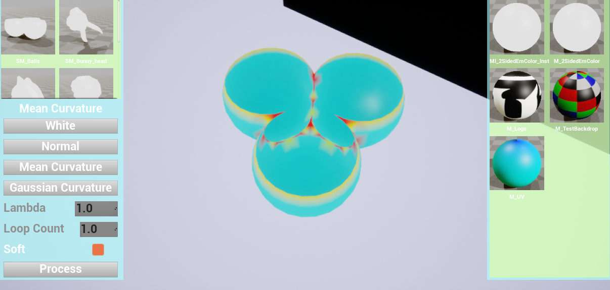
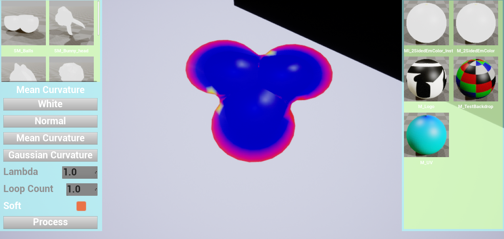
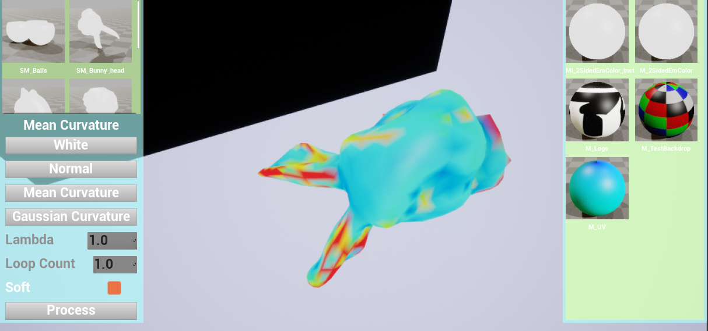
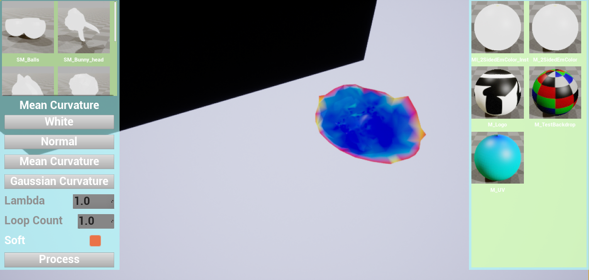
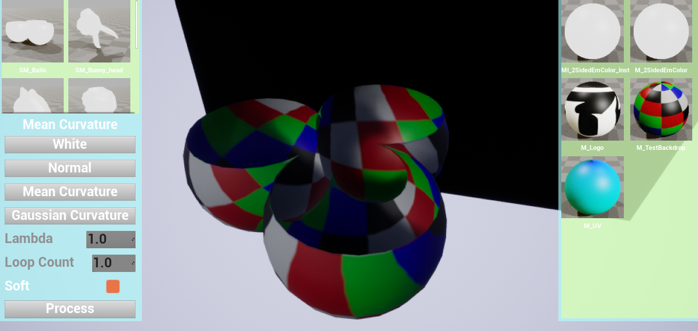
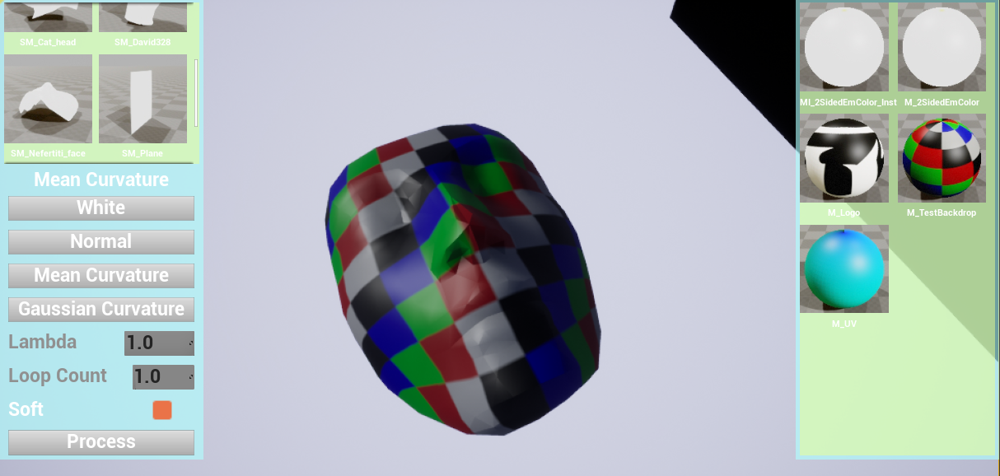
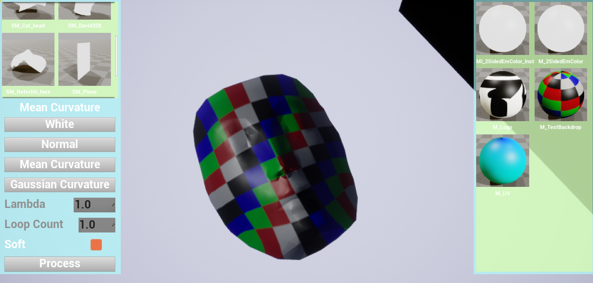
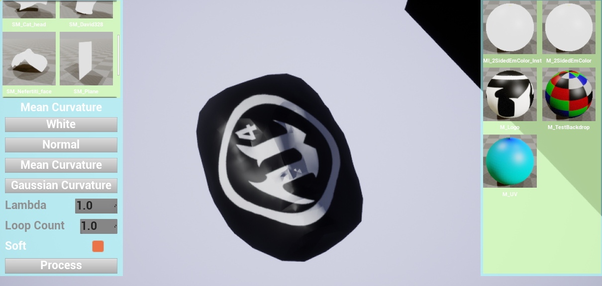
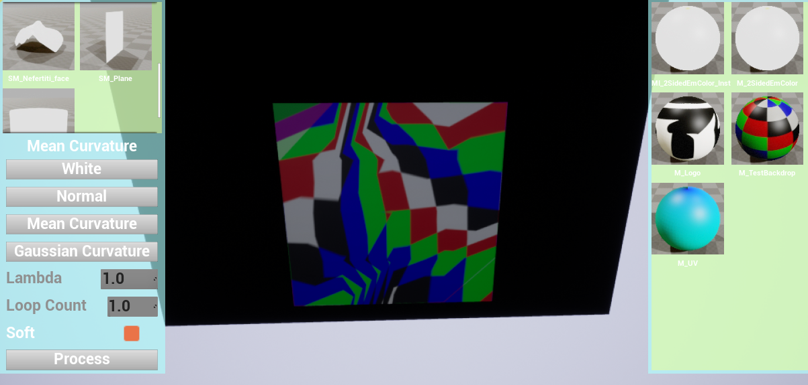

# GAMES102 HW7 
 
## 任务 
 
- 实现极小曲面的全局方法：边界固定，求解方程组 
- 实现曲面参数化：边界映射到平面，求解方程组 
 
## 目的 
 
学习使用数学库（推荐 Eigen 库）求解稀疏线性方程组 
 
## 数据 

带一条边界的网格曲面（暂不处理复杂曲面） 
 
 
## 实验方法 
 
### 实现极小曲面的全局方法 
 
- 利用Cotangent Formula Laplace-Beltrami算子：
  $\sigma_i=\sum_{j \in N(i)}{w_{ij}*(v_i-v_j)}$，其中
  $w_{ij}=cot\alpha+cot\beta$
  
  得到每个非边界顶点$v_i$需要满足的方程：
  $\sigma_i=0$
 
- 由于本次实验使用的网格均带一条边界，并且不想修改边界的位置，所以使用Hard Constraint，即边界点不作为方程未知数。 
  此时，为了使用$\sigma_i=\sum_{j \in N(i)}{w_{ij}*(v_i-v_j)}$公式得到线性方程组$Lv=0$时，需要把边界点项移到右侧。 
  
### 曲面参数化 

- 先求出边界点的参数化坐标。先得到排好序的边界，然后根据边界的周长把边界分为四段。
  四段的四个端点设为$(0,0),(1,0),(1,1),(0,1)$，段内点的坐标根据长度进行插值得到。

- 然后使用与上述一样的方法构造线性方程组$Lv=0$，只是求解得到的$v$为参数化坐标，此时不使用第三个维度的信息。
 
### 代码实现 
   
- 使用Unreal Engine 4.24实现。除UI、材质使用蓝图实现之外，使用C++实现。  
  实验相关代码在ArteriesProcessing插件中，其中计算极小曲面、参数化的代码在ArteriesProcessing/Processing/文件夹中。 
  Half Edge结构使用了商城第三方插件中的实现，稀疏线性方程组的求解使用了Eigen库的实现。 
 
## 运行结果 
 
- 全局方法的效率非常高，即使是面数较多的兔子头，也只需要很短的时间就求解出极小曲面。 
 
 
 
 
 
 
- 参数化结果总体满足预期

 
 
 
 

- 但是在使用顶点较少的平面时，参数化的结果就比较扭曲

 
 
- 详细操作方式与结果显示见视频。 
