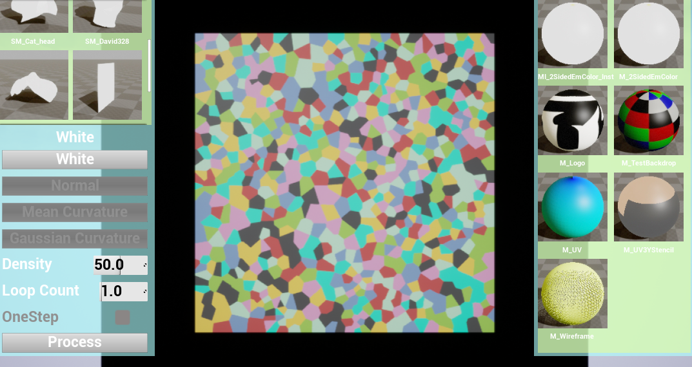
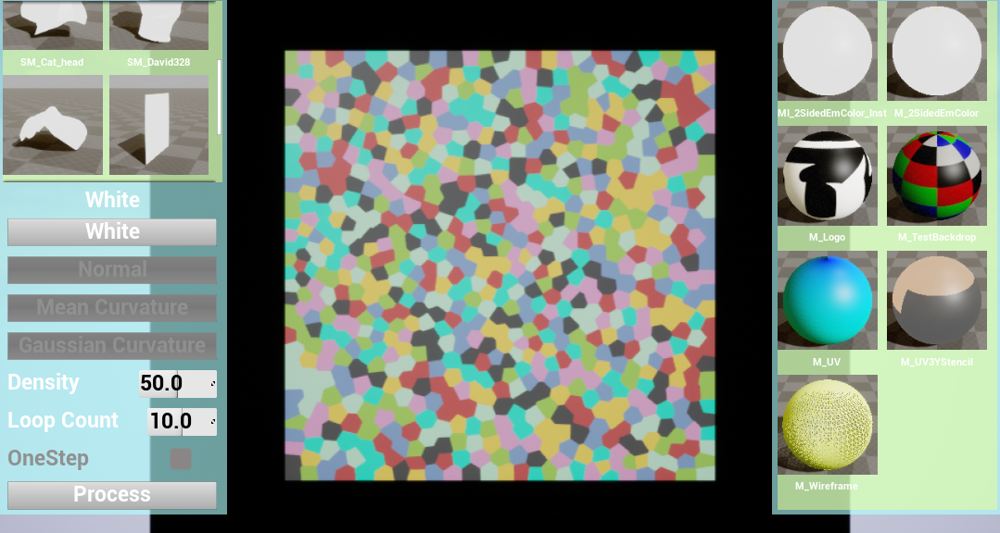
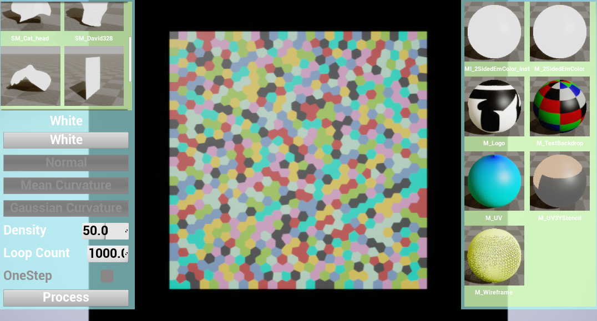
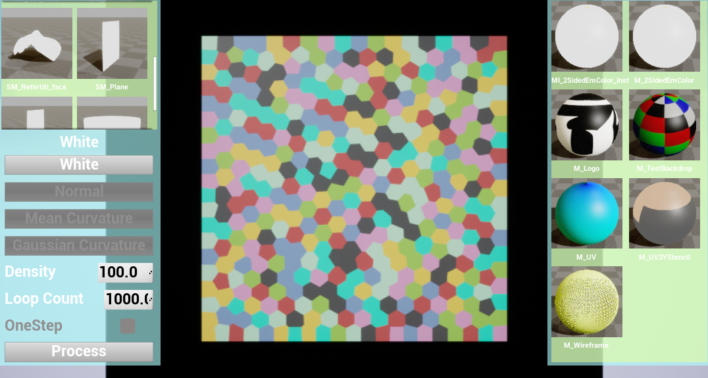
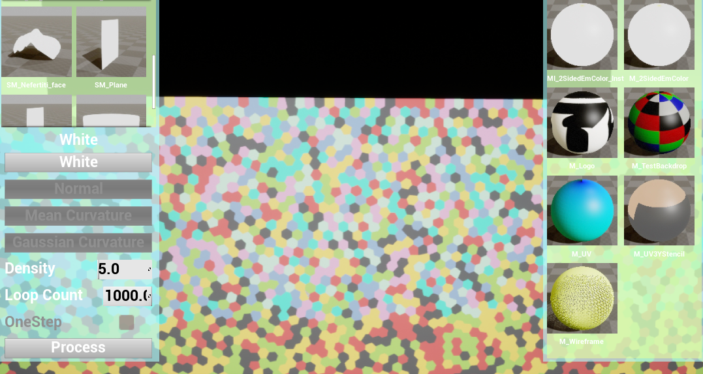

# GAMES102 HW8 
 
## 任务

实现平面点集 CVT 的 Lloyd 算法

## 目的

学习 Voronoi 算法、使用相关数学库（如 [Triangle](http://www.cs.cmu.edu/~quake/triangle.html)、[CGAL](https://www.cgal.org/) 等）

## 步骤

- 在给定的正方形区域内随机生成若干采样点
- 生成这些点的 Voronoi 剖分
- 计算每个剖分的中心，将采样点的位置更新到重心
- 迭代步骤 2 和 3

## 思考（非必要、可选）

如何在曲面上采样并生成 CVT（如何将算法推广到流形曲面）？
 
 
## 实验方法 
 
- 使用如步骤所示的Lloyd算法求解Centroidal Voronoi Tessellation.
  每一步求解Voronoi Diagram时使用了jc_voronoi库: https://github.com/JCash/voronoi
  
- 可以尝试在离散流形曲面的参数化平面上求出CVT，然后把参数映射到空间中，以此在流形曲面上生成CVT.
  但是本次实验没有尝试实现该方法，主要原因在于没有想到很好的离散网格的参数到空间的映射求解方法。
  可能的方法包括：重心坐标插值、函数拟合等。
 
## 运行结果 
 
- 迭代一次的结果比较随机

 

- 迭代次数增多后，每个cell的形状逐渐趋近于正六边形

 
 
 
 
